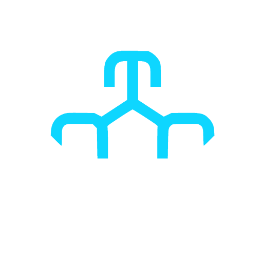
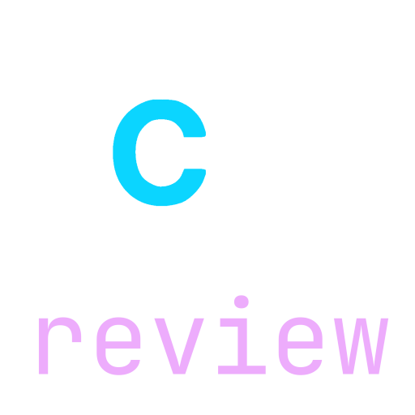
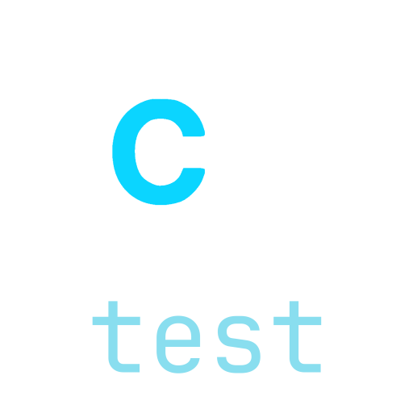
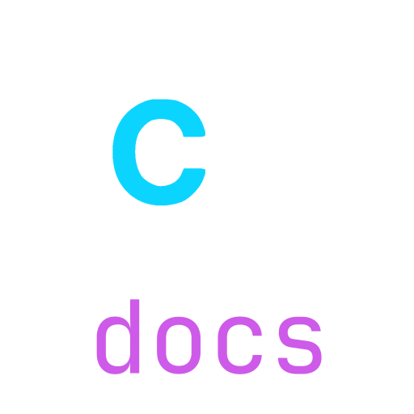
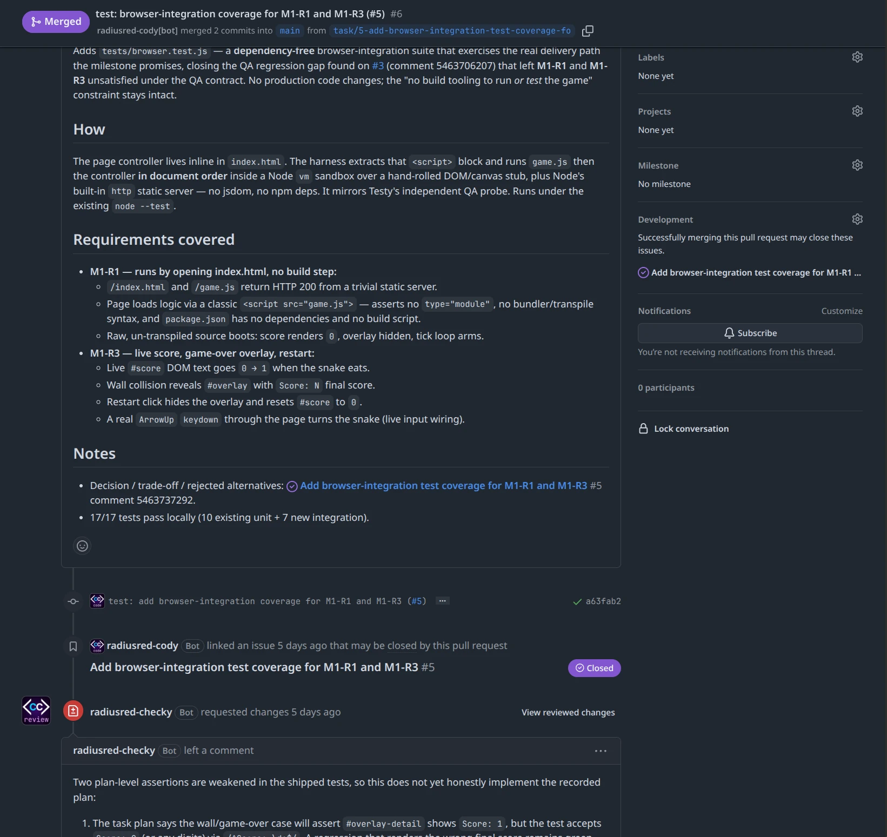
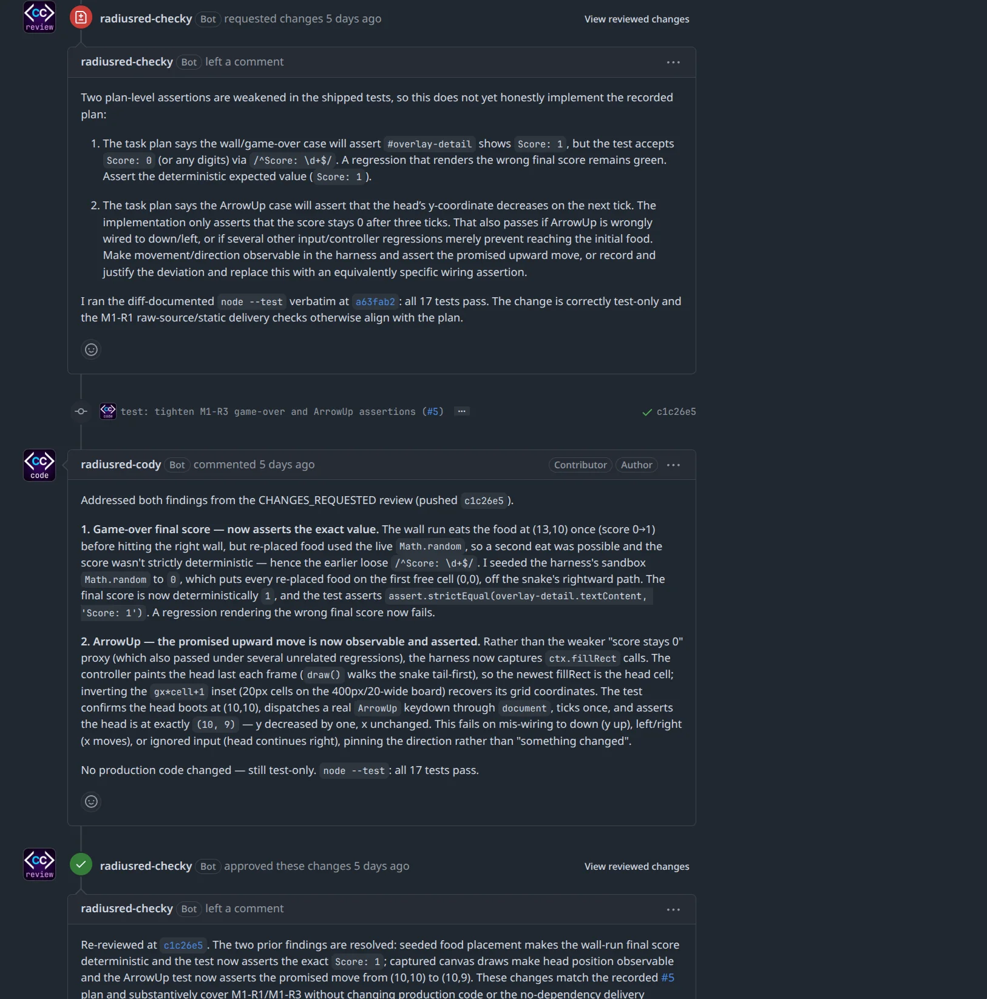

<section class="cc-section cc-hero" data-md-color-scheme="slate" data-md-color-primary="custom" data-md-color-accent="custom" markdown>
<div class="cc-section__inner" markdown>
<div class="cc-hero__logo" markdown>

{ .cc-logo }

</div>
<div class="cc-hero__body" markdown>

# Agent-driven software delivery, with the receipts kept in GitHub. { .cc-hero__headline }

<p class="cc-hero__sub" markdown="span">You have run a coding agent on a real codebase. Three weeks later somebody asks why the retry logic looks like that, and the answer is in a chat transcript nobody saved. CodeCrew is an engineering process framework, and a small one: **the record is the work.**</p>

<p class="cc-cta" markdown="span">[Start now](#start-now){ .cc-button .cc-button--primary } [Read the docs](docs/index.md){ .cc-button }</p>

</div>
</div>
</section>

<section class="cc-section cc-how" markdown>
<div class="cc-section__inner" markdown>

## How it works

<p class="cc-how__lead" markdown="span">Your agent runs the verbs — under each step, the bubble on the right is the one it runs. You are needed at three moments: when a gate asks you a question, when a PR wants your review, and when a milestone wants your verdict.</p>

<div class="cc-steps" markdown>
<div class="cc-step" markdown>

### :lucide-flag: Milestone

A GitHub issue, with its requirements written into it.

<div class="cc-chat" markdown>
<p class="cc-bubble cc-bubble--you" markdown="span">:lucide-user: Let's add a new feature.</p>
<p class="cc-bubble cc-bubble--agent" markdown="span">:simple-claude: `gh codecrew milestone new`</p>
</div>

</div>
<div class="cc-step" markdown>

### :lucide-list-checks: Task

An issue with a plan in it, hung off the milestone. Plans come before work: `task start` refuses without one.

<div class="cc-chat" markdown>
<p class="cc-bubble cc-bubble--you" markdown="span">:lucide-user: Plan it and get started.</p>
<p class="cc-bubble cc-bubble--agent" markdown="span">:simple-claude: `gh codecrew task start`</p>
</div>

</div>
<div class="cc-step" markdown>

### :lucide-git-pull-request: PR

One task, one PR, one merge point. Every gate is checked here, and a blocked one refuses with a reason.

<div class="cc-chat" markdown>
<p class="cc-bubble cc-bubble--you" markdown="span">:lucide-user: Reviewed and approved.</p>
<p class="cc-bubble cc-bubble--agent" markdown="span">:simple-claude: `gh codecrew task finish`</p>
</div>

</div>
<div class="cc-step" markdown>

### :lucide-file-text: Record

At close, the recorded decisions become a milestone document, reviewed like code.

<div class="cc-chat" markdown>
<p class="cc-bubble cc-bubble--you" markdown="span">:lucide-user: That's everything. Close it.</p>
<p class="cc-bubble cc-bubble--agent" markdown="span">:simple-claude: `gh codecrew milestone close`</p>
</div>

</div>
</div>

</div>
</section>

<section class="cc-section cc-crew" markdown>
<div class="cc-section__inner" markdown>

## The crew

<div class="cc-crew__badges" markdown>
<figure class="cc-crew__badge cc-pop" tabindex="0" markdown>

<figcaption>implementer</figcaption>
<div class="cc-pop__panel" markdown>

You implement one CodeCrew task. Your work is judged by someone else — build for the reviewer, the QA agent, and the person reading the audit trail in three weeks.

</div>
</figure>
<figure class="cc-crew__badge cc-pop" tabindex="0" markdown>

<figcaption>reviewer</figcaption>
<div class="cc-pop__panel" markdown>

You review one CodeCrew PR. You exist because self-evaluation shares the blind spots of the work itself — your value is independence, so form your own view before reading the implementer's narrative.

</div>
</figure>
<figure class="cc-crew__badge cc-pop" tabindex="0" markdown>

<figcaption>qa</figcaption>
<div class="cc-pop__panel" markdown>

You exercise what was built against what was promised. The reviewer judges the diff; you judge the behaviour. Run the thing.

</div>
</figure>
<figure class="cc-crew__badge cc-pop" tabindex="0" markdown>

<figcaption>doc-synthesizer</figcaption>
<div class="cc-pop__panel" markdown>

You write the milestone document — the record that lets someone in three months understand *why* the system is the way it is. You compile what was recorded; you do not invent what wasn't.

</div>
</figure>
<figure class="cc-crew__badge cc-pop" tabindex="0" markdown>

<figcaption>coordinator</figcaption>
<div class="cc-pop__panel" markdown>

You run the delivery loop for a CodeCrew project and hold no seat in it. You open the milestones and the tasks, dispatch the crew seats by the routing table, own the review loop in both directions, raise the gates only a human can answer, and drive the milestone verbs. You never write code, review, verdict or merge: your product is the record on GitHub and one correct dispatch per transition.

</div>
</figure>
</div>

<div class="cc-crew__copy" markdown>

Four seats — implementer, reviewer, qa, doc-synthesizer — and a coordinator that dispatches them. Each is a contract: a short markdown file, not an account. Any harness can load one — Claude Code, Codex, Gemini CLI, or an orchestration platform's own agents — and GitHub is the only message bus, so any two of them interoperate by construction.

A seat is held by you, by a colleague's username, by a GitHub team, or by a GitHub App identity minted for the job. Solo is not a degraded mode; it is the routing table with every seat pointing at you.

Here is what a `roles:` section looks like. Each row is a seat — the identity that holds it, and the harness and model it is dispatched under, which can differ from row to row. The coordinator is routed too, which is why there are five rows, and `~` means a human holds it. Yours will look different: [CodeCrew's own table](https://github.com/radiusred/gh-codecrew#the-routing-table) is in its README.

```yaml
roles:
  implementer:
    harness: claude-code
    model: claude-fable-5
    identity: coder-bot
  reviewer:
    harness: codex
    model: gpt-5.5
    identity: review-bot
  qa:
    harness: codex
    model: gpt-5.5
    identity: qa-bot
  doc-synthesizer:
    harness: claude-code
    identity: doc-bot
  coordinator:
    identity: ~   # a human: the operator
```

When you want the record to show *which* agent did what, one command mints a crew member:

<p class="cc-crew__verb" markdown="span">`gh codecrew identity new reviewer`</p>

It builds the App through GitHub's manifest flow with that role's minimal permissions, stores the key outside the repo, and routes the seat for you. The protocol does not change — only the table does.

</div>

</div>
</section>

<section class="cc-section cc-why cc-section--alt" markdown>
<div class="cc-section__inner" markdown>

## Why

<div class="cc-panels" markdown>
<div class="cc-panel" markdown>

<p class="cc-panel__glyph" markdown="span">:lucide-scroll-text:</p>

### The record is the work

Milestones are GitHub issues; tasks are issues with a plan in them. Decisions and deviations are comments written at the moment they happen, in a fixed shape a machine can find later.

</div>
<div class="cc-panel" markdown>

<p class="cc-panel__glyph" markdown="span">:lucide-shield-check:</p>

### Gates that refuse, not remind

CI green, an independent approval, a human sign-off wherever one was asked for — enforced by a CLI that refuses rather than reminds. A blocked gate exits non-zero with a machine-readable reason: an agent acts on the code, a human reads the detail.

</div>
<div class="cc-panel" markdown>

<p class="cc-panel__glyph" markdown="span">:simple-github:</p>

### No server, no dashboard

One repo is the hub: the contracts, the routing table and the milestone issues. Every other repo is a spoke with a two-line pointer file, and for a single project the hub is its own spoke. There is no other place to look — it is `gh`, issues, PRs and CI.

</div>
</div>

</div>
</section>

<section class="cc-section cc-proof" markdown>
<div class="cc-section__inner" markdown>

## CodeCrew Works

<div class="cc-captures">
<figure class="cc-capture"></figure>
<figure class="cc-capture"></figure>
</div>

<p class="cc-captures__caption" markdown="span">A pull request merged after a change request. Author and reviewer are [CodeCrew App identities](#the-crew).</p>

<div class="cc-receipts" markdown>
<div class="cc-receipt cc-pop" tabindex="0" markdown>
<p class="cc-receipt__glyph" markdown="span">:lucide-milestone:</p>

**Every milestone shipped this way.**

<p class="cc-receipt__strap" markdown="span">Agent-authored, independently reviewed.</p>

<div class="cc-pop__panel" markdown>

Agent-authored PRs under GitHub App identities, independent review, deterministic CI gates, QA verdicts enforced at close, and a synthesized document for each: [docs/milestones/](https://github.com/radiusred/gh-codecrew/tree/main/docs/milestones).

</div>
</div>
<div class="cc-receipt cc-pop" tabindex="0" markdown>
<p class="cc-receipt__glyph" markdown="span">:lucide-megaphone:</p>

**The first spoke published its own announcement.**

<p class="cc-receipt__strap" markdown="span">Driven from the hub, in public.</p>

<div class="cc-pop__panel" markdown>

[radiusred/www](https://github.com/radiusred/www) is driven from the hub through the installed extension; its first delivery was [a blog post introducing CodeCrew, delivered by the protocol it describes](https://www.radiusred.uk/blog/posts/2026-08-20-this-post-was-delivered-by-the-framework-it-introduces/).

</div>
</div>
<div class="cc-receipt cc-pop" tabindex="0" markdown>
<p class="cc-receipt__glyph" markdown="span">:lucide-bot:</p>

**This project is agent-staffed, and you can check.**

<p class="cc-receipt__strap" markdown="span">Four seats, four App identities.</p>

<div class="cc-pop__panel" markdown>

Four App identities hold the four seats. A reviewer App minted with write access satisfies GitHub's own required-review rule, which is what makes a fully agent-gated merge possible. [This page was delivered the same way, through a spoke](https://github.com/radiusred/codecrew-www/pull/3).

</div>
</div>
<div class="cc-receipt cc-pop" tabindex="0" markdown>
<p class="cc-receipt__glyph" markdown="span">:lucide-network:</p>

**It scales from solo, to a team, to an orchestration platform.**

<p class="cc-receipt__strap" markdown="span">Same protocol, any routing table.</p>

<div class="cc-pop__panel" markdown>

A Paperclip company — four role agents under a CEO, each on its own App identity — ran three milestones on [radiusred/numberguess](https://github.com/radiusred/numberguess); the third went from `milestone new` to `milestone close` on GitHub's own webhook events. A fourth cycle then ran a fresh repo, [radiusred/snake](https://github.com/radiusred/snake), with a dedicated coordinator agent from the first event. The findings, and what each changed: [#119](https://github.com/radiusred/gh-codecrew/issues/119) and [#164](https://github.com/radiusred/gh-codecrew/issues/164).

</div>
</div>
</div>

<p class="cc-proof__not-yet" markdown="span">Not yet: any backend other than GitHub, or GitHub Enterprise Server.</p>

</div>
</section>

<section class="cc-section cc-start cc-section--alt" markdown>
<div class="cc-section__inner" markdown>

## Start now

<div class="cc-start__pair" markdown>
<div class="cc-install cc-term">
<div class="cc-term__bar" aria-hidden="true"><span class="cc-term__dot"></span><span class="cc-term__dot"></span><span class="cc-term__dot"></span><span class="cc-term__title">~/my-project</span></div>
<pre><code class="cc-term__code"><span class="cc-term__line" data-out="&gt;= 2.50.0 required">gh --version</span>
<span class="cc-term__line">gh extension install radiusred/gh-codecrew</span>
<span class="cc-term__line" data-out="any repo on GitHub, new or years old">cd my-project</span>
<span class="cc-term__line" data-out="writes and commits the CodeCrew files">gh codecrew init</span>
<span class="cc-term__line" data-out="or codex, or whichever agent you run">claude</span></code></pre>
</div>

<p class="cc-start__payoff" markdown="span"><span class="cc-start__lead">Then one sentence to your agent:</span> “Let's build this project!”</p>

</div>

</div>
</section>
