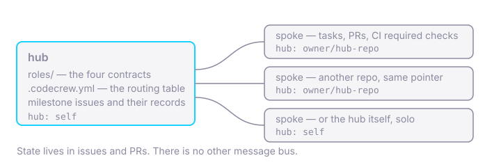

<section class="cc-section cc-hero" data-md-color-scheme="slate" data-md-color-primary="custom" data-md-color-accent="custom" markdown>
<div class="cc-section__inner" markdown>
<div class="cc-hero__logo" markdown>

{ .cc-logo }

</div>
<div class="cc-hero__body" markdown>

# Agent-driven software delivery, with the receipts kept in GitHub. { .cc-hero__headline }

<p class="cc-hero__sub" markdown="span">You have run a coding agent on a real codebase. Three weeks later somebody asks why the retry logic looks like that, and the answer is in a chat transcript nobody saved. CodeCrew is an engineering process framework, and a small one: **the record is the work.**</p>

<p class="cc-cta" markdown="span">[Start now](#start-now){ .cc-button .cc-button--primary } [Read the docs](https://github.com/radiusred/gh-codecrew#readme){ .cc-button }</p>

</div>
</div>
</section>

<section class="cc-section cc-how" markdown>
<div class="cc-section__inner" markdown>

## How it works

<p class="cc-how__lead" markdown="span">Your agent runs the verbs — the line under each step is the one it runs. You are needed at three moments: when a gate asks you a question, when a PR wants your review, and when a milestone wants your verdict.</p>

<div class="cc-steps" markdown>
<div class="cc-step cc-step--bg" style="--cc-step-bg: url(../assets/images/steps/milestone.webp); --cc-step-bg-ratio: 533 / 532; --cc-step-bg-y: 62%" markdown>

### :lucide-flag: Milestone

A GitHub issue, with its requirements written into it.

<p class="cc-step__line cc-step__agent" markdown="span">:simple-claude: `gh codecrew milestone new`</p>
<p class="cc-step__line cc-step__you" markdown="span">:lucide-user: Say what you want built.</p>

</div>
<div class="cc-step cc-step--bg" style="--cc-step-bg: url(../assets/images/steps/task.webp); --cc-step-bg-ratio: 529 / 653; --cc-step-bg-y: 2%" markdown>

### :lucide-list-checks: Task

An issue with a plan in it, hung off the milestone. Plans come before work: `task start` refuses without one.

<p class="cc-step__line cc-step__agent" markdown="span">:simple-claude: `gh codecrew task start`</p>
<p class="cc-step__line cc-step__you" markdown="span">:lucide-user: Answer any gate it raises.</p>

</div>
<div class="cc-step cc-step--bg" style="--cc-step-bg: url(../assets/images/steps/pr.webp); --cc-step-bg-ratio: 520 / 638; --cc-step-bg-y: 21%" markdown>

### :lucide-git-pull-request: PR

One task, one PR, one merge point. Every gate is checked here, and a blocked one refuses with a reason.

<p class="cc-step__line cc-step__agent" markdown="span">:simple-claude: `gh codecrew task finish`</p>
<p class="cc-step__line cc-step__you" markdown="span">:lucide-user: Review it — the second moment.</p>

</div>
<div class="cc-step cc-step--bg" style="--cc-step-bg: url(../assets/images/steps/record.webp); --cc-step-bg-ratio: 526 / 628; --cc-step-bg-y: 0%" markdown>

### :lucide-file-text: Record

At close, the recorded decisions become a milestone document, reviewed like code.

<p class="cc-step__line cc-step__agent" markdown="span">:simple-claude: `gh codecrew milestone close`</p>
<p class="cc-step__line cc-step__you" markdown="span">:lucide-user: Verdict every requirement.</p>

</div>
</div>

</div>
</section>

<section class="cc-section cc-crew" markdown>
<div class="cc-section__inner" markdown>

## The crew

<div class="cc-crew__badges">
<figure class="cc-crew__badge"><figcaption>implementer</figcaption></figure>
<figure class="cc-crew__badge"><figcaption>reviewer</figcaption></figure>
<figure class="cc-crew__badge"><figcaption>qa</figcaption></figure>
<figure class="cc-crew__badge"><figcaption>doc-synthesizer</figcaption></figure>
<figure class="cc-crew__badge"><figcaption>coordinator</figcaption></figure>
</div>

<div class="cc-crew__copy" markdown>

Four seats — implementer, reviewer, qa, doc-synthesizer — and a coordinator that dispatches them. Each is a contract: a short markdown file, not an account. Any harness can load one — Claude Code, Codex, Gemini CLI, or an orchestration platform's own agents — and GitHub is the only message bus, so any two of them interoperate by construction.

A seat is held by you, by a colleague's username, by a GitHub team, or by a GitHub App identity minted for the job. Solo is not a degraded mode; it is the routing table with every seat pointing at you.

When you want the record to show *which* agent did what, one command mints a crew member:

<p class="cc-crew__verb" markdown="span">`gh codecrew identity new reviewer`</p>

It builds the App through GitHub's manifest flow with that role's minimal permissions, stores the key outside the repo, and routes the seat for you. The protocol does not change — only the table does.

</div>

</div>
</section>

<section class="cc-section cc-why cc-section--alt" markdown>
<div class="cc-section__inner" markdown>

## Why

<div class="cc-panels" markdown>
<div class="cc-panel" markdown>

### The record is the work

Milestones are GitHub issues; tasks are issues with a plan in them. Decisions and deviations are comments written at the moment they happen, in a fixed shape a machine can find later.

</div>
<div class="cc-panel" markdown>

### Gates that refuse, not remind

CI green, an independent approval, a human sign-off wherever one was asked for — enforced by a CLI that refuses rather than reminds. A blocked gate exits non-zero with a machine-readable reason: an agent acts on the code, a human reads the detail.

</div>
<div class="cc-panel" markdown>

### No server, no dashboard

{ .cc-panel__figure }

One repo is the hub: the contracts, the routing table and the milestone issues. Every other repo is a spoke with a two-line pointer file, and for a single project the hub is its own spoke. There is no other place to look — it is `gh`, issues, PRs and CI.

</div>
</div>

</div>
</section>

<section class="cc-section cc-proof" markdown>
<div class="cc-section__inner" markdown>

## It has shipped

<div class="cc-receipts" markdown>

- **Every milestone of the framework itself was delivered with it.** Agent-authored PRs under GitHub App identities, independent review, deterministic CI gates, QA verdicts enforced at close, and a synthesized document for each: [docs/milestones/](https://github.com/radiusred/gh-codecrew/tree/main/docs/milestones).
- **This project is agent-staffed, and you can check.** Four App identities hold the four seats: the implementer implements, the reviewer reviews, the qa seat gives verdicts, the doc-synthesizer writes. PRs merge on the reviewer's approval — a reviewer App minted with write access satisfies GitHub's own required-review rule, which is what makes a fully agent-gated merge possible. [This page was delivered the same way, through a spoke](https://github.com/radiusred/codecrew-www/pull/3).
- **The first spoke published its own announcement.** [radiusred/www](https://github.com/radiusred/www) is driven from the hub through the installed extension; its first delivery was [a blog post introducing CodeCrew, delivered by the protocol it describes](https://www.radiusred.uk/blog/posts/2026-08-20-this-post-was-delivered-by-the-framework-it-introduces/).
- **An orchestration platform drove the whole crew, with no human but at the gates.** A Paperclip company — four role agents under a CEO, each on its own App identity — ran three milestones on [radiusred/numberguess](https://github.com/radiusred/numberguess); the third went from `milestone new` to `milestone close` on GitHub's own webhook events. A fourth cycle then ran a fresh repo with a dedicated coordinator agent from the first event. The findings, and what each changed: [#119](https://github.com/radiusred/gh-codecrew/issues/119) and [#164](https://github.com/radiusred/gh-codecrew/issues/164).

</div>

<p class="cc-proof__not-yet" markdown="span">Not yet: any backend other than GitHub, or GitHub Enterprise Server.</p>

</div>
</section>

<section class="cc-section cc-start cc-section--alt" markdown>
<div class="cc-section__inner" markdown>

## Start now

<div class="cc-install" markdown>

```sh
gh extension install radiusred/gh-codecrew
# any repo on GitHub, new or years old
cd my-project
# writes and commits the CodeCrew files
gh codecrew init
# or codex, or whichever agent you run
claude
```

</div>

Then one sentence to your agent: *Let's build this project!*

Two things to have first: `gh` 2.50.0 or later, and pull-request CI of some kind — `task finish` refuses a PR that reports no checks at all, because absence never satisfies a gate. Ten lines of workflow do; the [quickstart](https://github.com/radiusred/gh-codecrew/blob/main/docs/first-milestone.md#5-finish-the-task) shows them.

</div>
</section>
